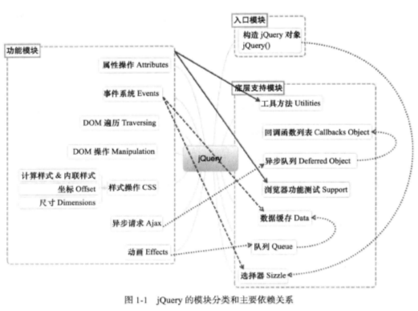

#第一部分  总体结构

##第 1 章  总体结构

###1.1  设计理念

"write less, do more".

jQuery 的核心特性为：  

* 兼容主流浏览器，支持 IE 6.0+/Chrome/Firefox 3.6+/Safari 5.0+/Opera 等。
* 独特的链式语法和短小清晰的多功能接口。
* 灵活的 CSS 选择器，并且可对 CSS 选择器进行扩展。
* 拥有便捷的插件机制和丰富的插件

###1.2  总体架构

<center></center>

```
(function(window, undefined) {
    //构造 jQuery 对象
    var jQuery = (function() {
      var jQuery = function(selector, context, rootjQuery) {
        return new jQuery.fn.init(selector, context, rootjQuery);
      }
      return jQuery;
    })();
    //工具方法 Utilities
    //回调函数列表 Callback Object
    //异步队列 Deferred Object
    //浏览器功能测试 Support
    //数据缓存 Data
    //队列 Queue
    //属性操作 Attributes
    //事件系统 Events
    //选择器 Sizzle
    //DOM 遍历 Traversing
    //DOM 操作 Manipulation
    //样式操作 CSS（计算样式/内联样式）
    //异步请求 Ajax
    //动画 Effect
    //坐标 Offset/尺寸/Dimensions
    window.jQuery = window.$ = jQuery;
})(window);
```

###1.3  自调用匿名函数

```
(function(window, undefined) {
  var jQuery = ...
  //...
  window.jQuery = Window.$ = jQuery;
}(window);
```

**1)为什么要创建一个自调用匿名函数？**  

通过创建一个自调用匿名函数，创建了一个特殊的函数作用域，该函数作用域中的代码不会和已有的同名函数/方法和变量以及第三方库冲突。  

自调用匿名函数的三种写法：

```
//写法一（常见写法）
(function() {
  //...
})();

//写法二
(function() {
  //...
}());

//写法三
!function() {
  //...
}();
```


#第二部分  构造 jQuery 对象

##第 2 章  构造 jQuery 对象

jQuery 对象是一个类数组对象，含有连续的整型属性/length 属性和大量的 jQuery方法。jQuery 对象由构造函数 jQuery() 创建，$() 则是 jQuery() 的缩写。

###2.1  构造函数 jQuery()

构造函数 jQuery() 有 7 种用法：  
        
.png)


#第三部分  底层支持模块

##第 3 章  选择器 Sizzle


##第 4 章  异步队列 Defferred Object


##第 5 章  数据缓存 Data


##第 6 章  队列 Queue


##第 7 章  浏览器功能测试 Support


#第四部分  功能模块

##第 8 章  属性操作 Attributes


##第 9 章  时间系统 Events


##第 10 章  DOM 遍历 Traversing


##第 11 章  DOM 操作 Manipulation


##第 12 章  样式操作 CSS


##第 3 章  异步请求 Ajax


##第 14 章  动画 Effect
